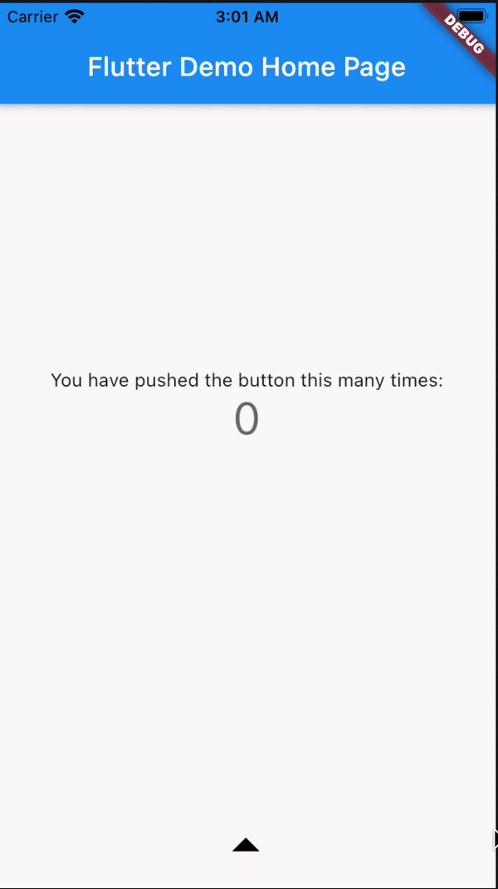

# drop_slider

A component that provides drop animation. It could be used for bottom swipe action.

<p>
    
</p>

## How to use


````dart
import 'package:drop_slider/drop_slider.dart';
````

Create a drop switch widget. The action will be
triggered when the minimum height is reached or element tap
(200px or when you click on the visible element by default)

```dart
    ...
    DropSlider(
      controller: _controller,
      color: Colors.blue,
      aboveWidget: (context, height) => Transform.translate(
        offset: Offset(-1, height * .2 < 15 ? 15 : height * .2),
        child: Icon(
          Icons.arrow_drop_up_outlined,
          color: Colors.black,
          size: 50,
        ),
      ),
      child: (context, height) => Padding(
        padding: EdgeInsets.only(bottom: height * .2),
        child: Icon(
          Icons.plus_one,
          size: height * .2,
          color: Colors.white,
        ),
      ),
    ),
    ...
```

You can also configure the widget using a controller to toggle animation:
```dart
  final _controller = DropSwipeController(position: 75);

  ...
  DropSlider(
      controller: _controller,
      aboveWidget: (context, height) => Transform.translate(
        offset: Offset(-1, height * .2 < 15 ? 15 : height * .2),
        child: Icon(
          Icons.arrow_drop_up_outlined,
          color: Colors.blue,
          size: 50,
        ),
      ),
      child: (context, height) => Padding(
        padding: EdgeInsets.only(bottom: height * .2),
        child: Icon(
          Icons.plus_one,
          size: height * .2,
          color: Colors.white,
        ),
      ),
    ),
    ...
```